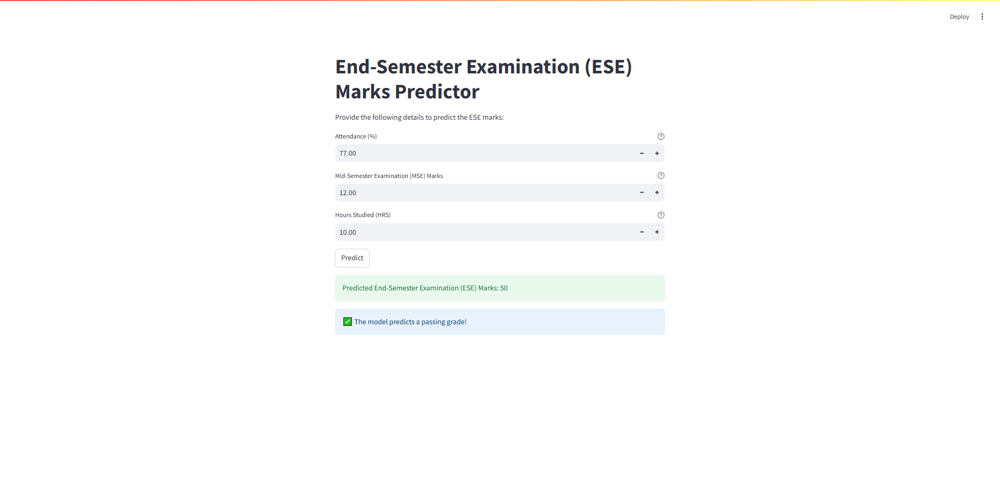
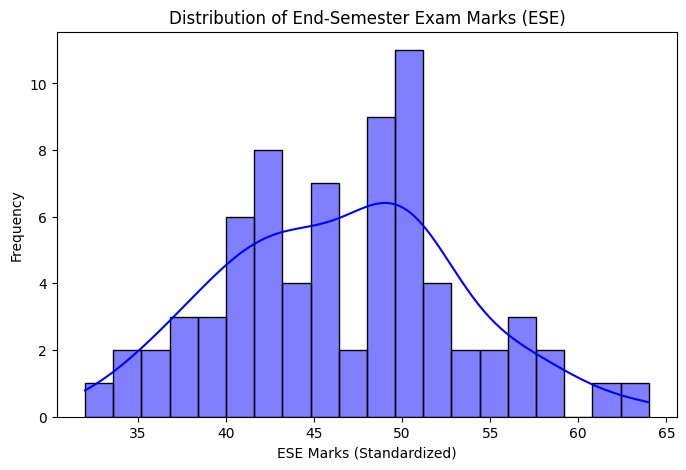

# EndExamScorePrediction

## Project Overview
EndExamScorePrediction is a tool designed to predict end-semester exam scores based on attendance, mid-semester exam marks, and study hours. It provides an interactive experience through a Streamlit app and detailed Jupyter notebooks for data exploration and model training. The core components include:
- **Application:** [app.py](app.py)
- **Notebooks:** [training.ipynb](training.ipynb) and [EndExamScorePrediction.ipynb](EndExamScorePrediction.ipynb)
- **Pre-trained Models:** [linear_regression_model.pkl](linear_regression_model.pkl) and [scaler.pkl](scaler.pkl)

## Features
- **Dynamic Score Prediction:** Input key parameters to predict exam scores with bounds checking.
- **Interactive Visualizations:** Charts and scatter plots for thorough data analysis.
- **Robust Algorithm:** Implements Linear Regression with cross-validation support.
- **Performance Metrics:** Evaluates models using MSE, RMSE, MAE, and R².
- **User-Friendly Interface:** Clean, web-based UI built with Streamlit.
- **Well-Structured Codebase:** Modular organization simplifies model retraining and enhancements.
- **Data Preprocessing:** Automatically handles missing values and normalizes features.

## Installation
1. **Prerequisites:**  
   - Python 3.7 or later  
   - pip package manager

2. **Clone the Repository:**
   ```bash
   git clone <repository-url>
   cd EndExamScorePrediction
   ```

3. **Setup Virtual Environment (Recommended):**
   ```bash
   python -m venv venv
   source venv/bin/activate  # On Windows: venv\Scripts\activate
   ```

4. **Install Dependencies:**
   ```bash
   pip install -r requirements.txt
   ```

5. **Data & Models Setup:**
   - Place `dataset.csv`, `linear_regression_model.pkl`, and `scaler.pkl` in the project root.

## Usage
- **Running the App:**  
  Start the Streamlit application:
  ```bash
  streamlit run app.py
  ```
- **Exploring Notebooks:**  
  Open `training.ipynb` or `EndExamScorePrediction.ipynb` in Jupyter Notebook/JupyterLab for interactive exploration.
- **Troubleshooting:**  
  - Verify file paths for models and data files.
  - Confirm all dependencies are installed.
  - Check console logs for error messages.

## Data
- **Dataset Overview:**  
  `dataset.csv` contains records of attendance, MSE marks, study hours, and actual ESE scores for 73 entries.
- **Preprocessing Steps:**  
  - Missing values are filled using column means.
  - Input features are normalized using a MinMaxScaler.
- **Data Quality:**  
  The dataset is curated to reflect a variety of cases ensuring a robust training process.

## Models
- **Pre-trained Linear Regression:**  
  The model (`linear_regression_model.pkl`) predicts ESE marks from the input features.
- **Scaler Object:**  
  `scaler.pkl` standardizes inputs, maintaining consistency during predictions.
- **Model Retraining:**  
  Users can retrain the model using the provided notebooks and update the pre-trained files accordingly.

## Visuals & UI
The project provides several images to showcase the interface and model performance:
- **Main UI:** 
- **Additional Views:**  
  - .png)
  - .png)
  - .png)
  - .png)
  - 

## Contributing
Contributions are highly welcome! To contribute:
- Fork the repository.
- Create a new branch for your feature or bugfix.
- Ensure your code follows the project's style guidelines.
- Submit a pull request detailing your changes.

## License
This project is licensed under the MIT License. Please refer to the [LICENSE](LICENSE) file for complete details.

## Acknowledgments
- Special thanks to all contributors and the open-source community for their support.
- Gratitude to educators and developers whose work inspired this project.